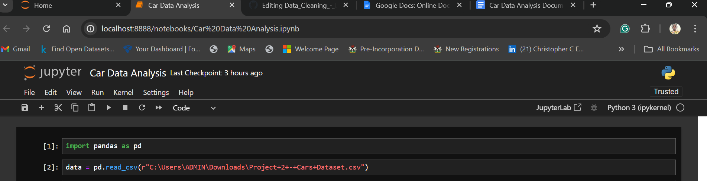

# Introduction
This project is centered around data cleaning and manipulation using the Python library "pandas." The dataset utilized for this project was provided by Data Science Lovers on the Udemy platform.

## Problem Statement
The objective of this project is to enable participants to become proficient in data cleaning and manipulation using the Pandas library in Python, a crucial skill for data analysts.
## Skills Demonstrated
1. Throughout the project, the following skills were demonstrated:
2. Data cleaning with Pandas
3. Utilizing Jupyter Notebook
4. Importing the Pandas library
5. Data manipulation
## Dataset Sourcing
The dataset used in this project is a car dataset provided by Data Science Lovers.
## Data Importing
Data was imported using Pandas with the following code:

# Data Cleaning and Analysis
## Data Shape:
Looking at the Dataset using the shape keyword, the dataset consists of 432 rows and 15 columns, as determined by data.shape.
## Handling Null Values:
Identified null values using data.isnull().sum(), which showed the number of null values in each column. Null values were addressed accordingly.
## Insight into Car Makes:
Gained insights into the number of cars by their makes using data['make'].value_counts().
## Filtering:
Filtered cars by origin using data['origin'].isin(['Asia', 'Europe']) to display only Asian and European cars.
Filtered cars with horsepower greater than 200 using data[data['horsepower'] > 200].
Removed cars with weight above 4000 using data[data['weight'] > 4000].
## Data Manipulation:
Increased the values in the MPG_City column by 3 using a __lambda__ function:

## Final Analysis:
Calculated the number of cars by region, revealing that Asia has the highest number of cars by origin.

# Conclusion
*This project served as a practice exercise to familiarize myself with Python and its libraries for data science and analysis. No data visualization was included in this project.*
Project completed by: *Christopher C. Enukoha*

